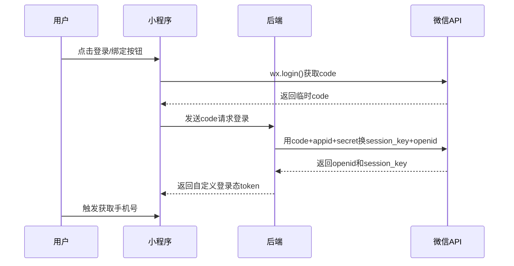

## 前置条件
1. 微信小程序已通过认证（非个人主体）
2. 开通微信开放平台账号并与小程序绑定
3. 服务器配置 HTTPS 域名
4. 小程序已获取`获取手机号`权限（需用户主动触发）
5. 数据库表结构设计（含openid、unionid、手机号等字段）

## 用户绑定流程

> Tip
1. 小程序端调用微信的 API ==wx.login()== 获取 ==code==（登录凭证，有效期5分钟）
2. 小程序带着获取的 ==code== 调用后端服务，请求登录
3. 后端拿到 ==code== 后，用 ==code==  + ==appid== （应用id 在微信平台查看） + == secret== （应用密钥，在微信平台查看 **最高机密**）换取用户的 ==session_key== （微信生成的会话密钥，通常几小时到一天，禁止返回前端） + ==openid== （用户在**当前小程序**的唯一标识，永久有效）==
4. 后端获取到用户的 ==session_key==  + ==openid== 后表明登录成功了，后续需要什么操作就可以通过 ==session_key==  + ==openid== 获取因此需要存入数据库，此时返回给小程序登录成功的 ==token==， ==token== 与用户的 ==openid== 做绑定。
