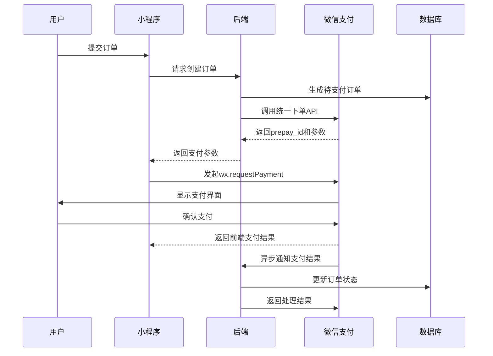

# 06-2.微信支付流程

## 前置条件
1. 已申请微信支付（商户平台账号）
2. 配置支付密钥APIv3和API证书
3. 小程序关联微信支付商户号
4. 数据库设计订单表（含订单号、金额、状态等字段）
5. 配置支付结果回调域名

## 流程



1. **加入购物车**：用户选择商品加入购物车（此步骤非必经过，因为可以直接购买）。
2. **创建订单**：用户确认购买后，小程序后端创建一个订单，订单状态为 “待支付”（例如：`WAIT_PAY`）。
3. **调用微信支付**：
    - 小程序前端向后端发起创建支付请求。
    - 后端调用微信支付统一下单 API生成预支付交易会话标识（`prepay_id`），然后生成支付参数（如 `appId`, `timeStamp`, `nonceStr`, `package`, `signType`, `paySign`）返回给前端。
    - 前端调用微信小程序支付 API（`wx.requestPayment`）唤起支付窗口。
4. **用户支付**：用户在微信支付窗口中输入密码或使用指纹等完成支付。
5. **支付回调**：微信支付服务器异步通知后端支付结果（通知地址在统一下单时设置的`notify_url`）。
    - 后端接收到支付结果通知后，进行签名验证和业务校验（如订单金额、订单状态等）。
    - 验证通过后，更新订单状态为 “已支付”（例如：`PAID`），并记录支付相关信息（如交易号、支付时间等）。
    - 然后，后端需要给微信支付服务器返回一个成功的响应（XML 格式，`<return_code><![CDATA[SUCCESS]]></return_code>`），否则微信会持续通知（重试策略）。
6. **更新订单状态**：在支付回调中更新订单状态。
7. **通知用户**：后端可以通过微信模板消息或其他方式通知用户支付成功


> 伪代码
```java
// 创建支付订单
@PostMapping("/createOrder")
public Response createOrder(@RequestBody OrderDTO dto, 
                           @RequestHeader("Authorization") String token) {
    
    // 1. 创建业务订单
    Order order = new Order();
    order.setOrderNo(generateOrderNo());
    order.setAmount(dto.getAmount());
    order.setOpenid(getOpenidFromToken(token));
    order.setStatus(OrderStatus.UNPAID);
    orderMapper.insert(order);
    
    // 2. 调用微信支付
    Map<String, String> paymentParams = wechatPayService.createJsapiOrder(
        order.getOrderNo(),
        order.getAmount(),
        "商品描述",
        order.getOpenid()
    );
    
    return Response.success(paymentParams);
}

// 微信支付回调处理
@PostMapping("/pay/notify")
public String paymentNotify(@RequestBody String xmlData) {
    // 1. 验证签名
    if(!wechatPayService.verifySignature(xmlData)) {
        return "<xml><return_code>FAIL</return_code></xml>";
    }
    
    // 2. 解析支付结果
    Map<String, String> result = parseXml(xmlData);
    if("SUCCESS".equals(result.get("return_code"))) {
        String orderNo = result.get("out_trade_no");
        
        // 3. 更新订单状态
        orderMapper.updateStatus(orderNo, OrderStatus.PAID);
        
        // 4. 其他业务逻辑...
    }
    
    return "<xml><return_code>SUCCESS</return_code></xml>";
}

// 微信支付服务类
public class WechatPayService {
    public Map<String, String> createJsapiOrder(String orderNo, int amount, 
                                              String description, String openid) {
        
        Map<String, String> params = new HashMap<>();
        params.put("appid", appId);
        params.put("mch_id", mchId);
        params.put("nonce_str", generateNonce());
        params.put("body", description);
        params.put("out_trade_no", orderNo);
        params.put("total_fee", String.valueOf(amount));
        params.put("spbill_create_ip", "用户IP");
        params.put("notify_url", "https://domain.com/pay/notify");
        params.put("trade_type", "JSAPI");
        params.put("openid", openid);
        
        // 生成签名并发送请求
        params.put("sign", generateSign(params, apiKey));
        String xml = mapToXml(params);
        String response = httpPost("https://api.mch.weixin.qq.com/pay/unifiedorder", xml);
        
        // 解析返回的prepay_id
        Map<String, String> respMap = xmlToMap(response);
        return buildPaymentParams(respMap.get("prepay_id"));
    }
    
    private Map<String, String> buildPaymentParams(String prepayId) {
        Map<String, String> params = new TreeMap<>();
        params.put("appId", appId);
        params.put("timeStamp", String.valueOf(System.currentTimeMillis()/1000));
        params.put("nonceStr", generateNonce());
        params.put("package", "prepay_id=" + prepayId);
        params.put("signType", "RSA");
        params.put("paySign", signWithRSA(params));
        return params;
    }
}
```


## 常见问题
### 一致性问题
在上述的支付流程中，`支付回调` 环节是最容易出现一致性问题的。
> 为什么会出现一致性问题？
- 网络波动/超时
	- 微信支付的回调通知是基于网络的，如果网络不稳定、商户服务器负载过高或出现超时，可能导致微信支付无法成功将回调通知发送到商户服务器。
	- **导致问题：** 用户已支付成功，但商户服务器未收到回调，订单状态仍停留在“待支付”。
- 商户服务处理回调时失败
	- 商户服务器在处理回调逻辑时（如更新数据库、扣减库存等）出现异常（如数据库连接失败、业务逻辑错误），导致未能正确更新订单状态。
	- **导致问题：** 用户已支付成功，回调也已接收，但业务处理失败，订单状态不一致。
- 微信支付重复回调
	- 在检测到业务系统处理失败或处理超时后，微信有重试机制可能会重复发送相同的回调通知。
	- **导致问题：** 如果商户服务器没有进行幂等性处理，可能会重复扣减库存、重复赠送积分等，导致业务数据不一致。
- 恶意攻击/伪造回调：
	- 可能会存在尝试伪造微信支付回调通知，以达到非法目的。
	- **导致问题：** 未经签名的伪造回调可能导致错误地将未支付订单标记为已支付。

> 如何解决？
- 针对网络波动/超时问题
	- 依托微信的重试机制，他调不到我们，拿就让他多调用几次
	- **兜底机制：** 定时扫描长时间处于“待支付”状态的订单（例如，支付时间已过5分钟但仍是“待支付”）。对于这些订单，后端主动调用微信支付的“查询订单”API，获取真实的支付状态。如果查询结果是“已支付”，则进行补单操作（更新订单状态、执行后续业务逻辑）。
- 针对商户服务器处理失败的问题
	- 完善的异常处理和日志记录。捕获在回调过程中可能出现的异常，记录日志，方便排查问题。
	- **事务机制：** 确保订单状态更新等操作在数据库中处于同一个事物，保证原子性。
	- **解耦：** 可以将与订单的后续操作进行解耦，放入消息队列中，减少处理逻辑。比如：回调中只修改订单状态，对于用户支付通知、用户积分增减等放入消息队列。
- 针对微信重复回调的问题
	- **幂等性处理**。在处理订单业务前，先根据回调中的唯一订单id查询数据库该订单的状态，如果该订单已经支付的话，返回微信success，避免重复处理。
	- **处理过程加锁**。微信支付的回调通知可能会因为网络重试等原因，在短时间内多次发送给你的后端服务。如果没有分布式锁，当多个相同的回调通知几乎同时到达并被不同的线程处理时，可能会发生重复处理。因此需要加锁。
		```java
		String lockKey = "PAY_LOCK:" + order.getOrderNo(); 
        if (redisLock.tryLock(lockKey, 10)) {
             try { 
		         // 处理支付回调 
	         
	         } finally { 
		         redisLock.unlock(lockKey); 
	         } 
         }
		```
- 针对恶意攻击/伪造回调
	- 签名校验（微信提供的方法），拿到数据后首先根据密钥进行解密。
